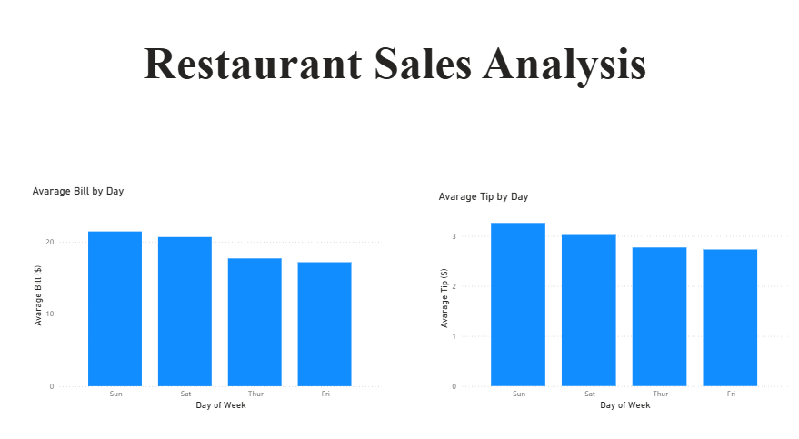

# Spark Data Lakehouse Pipeline

This project was created to reinforce concepts studied for the **Microsoft DP-900 (Azure Data Fundamentals)** certification.

The goal of the project is to simulate a simple **data pipeline** using Apache Spark, following a basic **Lakehouse architecture**, and finishing with a data visualization using Power BI.

---

# Project Overview

In this project we process a restaurant dataset using Spark and transform it into aggregated insights that can be visualized in a dashboard.

The pipeline follows this flow:

Dataset (CSV)  
↓  
Data processing with Apache Spark  
↓  
Data transformation and aggregation  
↓  
Power BI dashboard visualization

---

# Dataset

The dataset used is the **Tips dataset**, which contains restaurant transaction information.

Columns included:

- total_bill → total value of the bill  
- tip → tip given by the customer  
- sex → customer gender  
- smoker → smoker or non-smoker  
- day → day of the week  
- time → lunch or dinner  
- size → number of people at the table  

Dataset source:  
https://github.com/mwaskom/seaborn-data

---

# Data Processing

Using **Apache Spark**, the dataset was processed and aggregated to generate business insights.

Examples of metrics created:

- Average bill value by day of the week
- Average tip value by day of the week

These metrics were exported and used to build a dashboard.

---

# Dashboard

The final dataset was visualized using Power BI.

The dashboard displays:

- Average Bill by Day
- Average Tip by Day

---

# Technologies Used

- Python
- Apache Spark
- Pandas
- Power BI
- GitHub

---

# Repository Structure

spark-data-lakehouse-pipeline

data  
└── tips.csv  

notebooks  
└── spark_pipeline.ipynb  

dashboard  
└── restaurant_dashboard.pbix  

images  
└── dashboard.png  

README.md

---

# Learning Objectives

This project was built to practice concepts related to:

- Data processing
- Data pipelines
- Data aggregation
- Data visualization
- Lakehouse architecture fundamentals

These topics are part of the knowledge covered in the **Microsoft DP-900 Azure Data Fundamentals certification**.

---

# Author

Portfolio project created while studying **Azure Data Fundamentals (DP-900)**.
